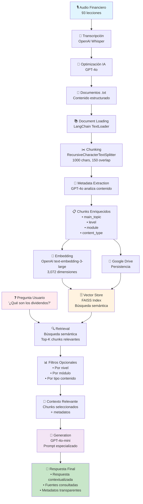

# 📈 Sistema RAG - Asistente de Inversión en Dividendos

Un sistema completo de **Retrieval-Augmented Generation (RAG)** especializado en inversión en dividendos, desarrollado como parte del curso de AI Engineering de KeepCoding.

## 🎯 Descripción del Proyecto

Este proyecto implementa un asistente inteligente capaz de responder preguntas específicas sobre estrategias de inversión en dividendos, análisis financiero y gestión de carteras. El sistema utiliza un extenso corpus de conocimiento especializado para proporcionar respuestas precisas y educativas.

## 📊 Características Principales

### 🧠 **Inteligencia Artificial Avanzada**
- **LLM Principal**: GPT-4o-mini para generación de respuestas
- **Embeddings**: OpenAI text-embedding-3-large (3,072 dimensiones)
- **Extracción de Metadatos**: GPT-4o para análisis automático de contenido

### 📚 **Base de Conocimiento Especializada**
- **93 documentos** de contenido financiero procesado
- **Pipeline de calidad**: Audio → Transcripción → Optimización con IA → Textos estructurados
- **Áreas temáticas**: Análisis fundamental, selección de brokers, psicología de inversión, gestión de riesgo, fiscalidad, ratios financieros
- **Organización modular**: 16 módulos temáticos + material complementario

### 🔍 **Sistema de Búsqueda Avanzado**
- **Vector Store**: FAISS para búsqueda semántica eficiente
- **Múltiples estrategias de retrieval**: Similarity, MMR, Threshold-based
- **Filtros por metadatos**: Nivel de dificultad, módulo, tipo de contenido
- **Chunking inteligente**: RecursiveCharacterTextSplitter optimizado

### ⚡ **Optimizaciones de Rendimiento**
- **Persistencia inteligente**: Chunks y vector store guardados en Google Drive
- **Carga incremental**: Evita reprocesamiento en ejecuciones posteriores
- **Pipeline LCEL**: LangChain Expression Language para máxima eficiencia

## 🏗️ Arquitectura del Sistema

### 📊 **Diagrama de Funcionamiento**

El siguiente diagrama muestra el flujo completo del sistema RAG, desde el procesamiento inicial hasta la generación de respuestas:



### 📋 **Metadatos Enriquecidos**
Cada chunk incluye:
- `main_topic`: Tema principal extraído con GPT-4o
- `level`: Nivel de dificultad (básico, intermedio, avanzado)
- `module`: Número de módulo del curso
- `lesson`: Número de lección
- `content_type`: Tipo de contenido (lección, introducción, bonus, etc.)
- `chunk_tokens`: Número de tokens para optimización

### 🔄 **Pipeline de Procesamiento**
1. **Document Loading**: Carga de archivos .txt con LangChain
2. **Chunking**: Segmentación con solapamiento para preservar contexto
3. **Metadata Extraction**: Análisis automático con GPT-4o
4. **Embedding**: Vectorización con OpenAI embeddings
5. **Indexing**: Creación de índice FAISS para búsqueda rápida
6. **Retrieval**: Búsqueda semántica con filtros
7. **Generation**: Respuesta contextualizada con GPT-4o-mini

## 🛠️ Stack Tecnológico

- **🦜 LangChain**: Framework para aplicaciones RAG
- **🤖 OpenAI**: GPT-4o-mini, GPT-4o, text-embedding-3-large
- **🔍 FAISS**: Base de datos vectorial de Meta AI
- **📊 Python**: Procesamiento de datos y análisis
- **☁️ Google Colab**: Entorno de desarrollo y ejecución
- **💾 Google Drive**: Persistencia de datos procesados

## 🚀 Instrucciones de Uso

### 1. **Preparación del Entorno**
```python
# Instalar dependencias
!pip install langchain langchain-openai langchain-community faiss-cpu tiktoken tqdm pandas matplotlib seaborn openai

# Configurar API Key
import os
import getpass
os.environ["OPENAI_API_KEY"] = getpass.getpass("Introduce tu OpenAI API Key: ")
```

### 2. **Carga de Datos**
- Sube el archivo `data.zip` con los documentos procesados
- El sistema detectará automáticamente si ya existen chunks procesados en Google Drive

### 3. **Consultas al Sistema**
```python
# Consulta básica
response = ask_dividends_expert("¿Qué son los dividendos?")

# Consulta con retriever específico
response = ask_dividends_expert(
    "¿Cuáles son las ventajas de invertir en dividendos?", 
    retriever_type="similarity"
)

# Búsqueda con filtros
filtered_results = search_with_filters(
    "dividendos", 
    level="intermedio", 
    module=2, 
    k=5
)
```

## 📈 Tipos de Consultas Soportadas

- **Conceptos fundamentales**: ¿Qué son los dividendos? ¿Cómo funcionan?
- **Estrategias de inversión**: Selección de acciones, diversificación, timing
- **Análisis financiero**: Ratios, métricas, evaluación de empresas
- **Gestión de riesgo**: Identificación y mitigación de riesgos
- **Aspectos fiscales**: Tributación de dividendos, optimización fiscal
- **Psicología de inversión**: Sesgos cognitivos, disciplina financiera

## 🎯 Ventajas del Sistema

### ✅ **Precisión y Relevancia**
- Respuestas basadas únicamente en el corpus especializado
- Sistema anti-alucinación que indica cuando no tiene información
- Contexto financiero específico en todas las respuestas

### ✅ **Transparencia**
- Fuentes consultadas visibles en cada respuesta
- Metadatos completos de cada documento utilizado
- Trazabilidad completa del proceso de generación

### ✅ **Flexibilidad**
- Múltiples estrategias de retrieval según el caso de uso
- Filtros avanzados por nivel, módulo y tipo de contenido
- Configuración adaptable a diferentes necesidades

### ✅ **Eficiencia**
- Persistencia inteligente evita reprocesamiento
- Pipeline optimizado con LCEL
- Búsqueda vectorial ultra-rápida con FAISS

## 📊 Estadísticas del Dataset

- **📚 Documentos**: 93 archivos de texto procesados
- **🧩 Chunks**: ~500-800 fragmentos (según configuración)
- **📏 Tamaño promedio**: ~1,000 caracteres por chunk
- **🔤 Tokens promedio**: ~250 tokens por chunk
- **📐 Dimensiones embedding**: 3,072 (text-embedding-3-large)

## 🔧 Configuración Avanzada

### **Parámetros de Chunking**
```python
chunk_size=1000,           # Tamaño máximo del chunk
chunk_overlap=150,         # Solapamiento entre chunks
separators=["\\n\\n", "\\n", ". "]  # Separadores preferenciales
```

### **Configuración de Retrievers**
```python
# Básico: Top 5 más similares
basic_retriever = vectorstore.as_retriever(search_kwargs={"k": 5})

# Con threshold: Solo chunks muy relevantes
similarity_retriever = vectorstore.as_retriever(
    search_type="similarity_score_threshold",
    search_kwargs={"k": 10, "score_threshold": 0.5}
)

# MMR: Balance entre relevancia y diversidad
mmr_retriever = vectorstore.as_retriever(
    search_type="mmr",
    search_kwargs={"k": 5, "fetch_k": 20, "lambda_mult": 0.7}
)
```

## 🎓 Contexto Académico

Este proyecto fue desarrollado como parte del **Curso de AI Engineering de KeepCoding**, demostrando:

- Implementación completa de un sistema RAG
- Procesamiento y optimización de datasets reales
- Integración de múltiples tecnologías de IA
- Buenas prácticas en ingeniería de prompts
- Optimización de rendimiento y costos
- Evaluación y testing de sistemas de IA

